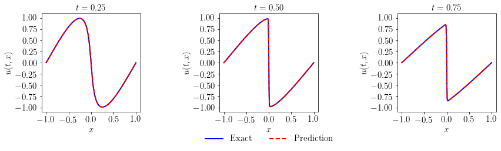

# Physics-Informed Neural Networks for Burgers' Equation

[](https://tensorflow.org/)
[](https://pytorch.org/)
[](https://python.org/)
[](LICENSE)
[](https://jupyter.org/)

A comprehensive implementation of **Physics-Informed Neural Networks (PINNs)** for solving Burgers' equation, covering both **forward problems** (inference) and **inverse problems** (parameter identification). This repository provides implementations in both **PyTorch** and **TensorFlow v1**.

## 📖 Overview

This repository implements the groundbreaking work by **Raissi, Perdikaris, and Karniadakis (2019)** on Physics-Informed Neural Networks, specifically applied to the nonlinear Burgers' equation. PINNs represent a revolutionary approach that combines deep learning with physical laws to solve partial differential equations without traditional numerical methods.

### What are Physics-Informed Neural Networks?

PINNs are neural networks that incorporate physical laws (described by PDEs) directly into the learning process. Instead of purely learning from data, they enforce physical constraints during training, making them:

- **Data-efficient**: Require fewer training points than traditional ML
- **Physics-consistent**: Solutions automatically satisfy conservation laws  
- **Mesh-free**: No need for structured grids or discretization
- **Versatile**: Handle both forward and inverse problems

## 🌊 Burgers' Equation

**Burgers' equation** is a fundamental nonlinear PDE that models various physical phenomena:

```math
\frac{\partial u}{\partial t} + u \frac{\partial u}{\partial x} = \nu \frac{\partial^2 u}{\partial x^2}
```

Where:
- `u(x,t)` is the velocity field
- `ν` is the kinematic viscosity
- Left side: **convection** (nonlinear transport)
- Right side: **diffusion** (viscous effects)

### Physical Significance
- **Fluid Dynamics**: 1D viscous flow modeling
- **Shock Wave Formation**: How smooth solutions develop discontinuities
- **Traffic Flow**: Vehicular dynamics modeling
- **Turbulence Studies**: Simplified energy cascade understanding

## 🎯 Problem Types

This repository demonstrates both fundamental types of PDE problems:

### 1. Forward Problems (Inference) 
**Given**: Complete PDE with known parameters  
**Find**: The solution u(x,t)

```python
# Known: ν = 0.01/π, boundary conditions, initial conditions
# Unknown: u(x,t) everywhere in the domain
```

### 2. Inverse Problems (Identification)
**Given**: Scattered data measurements  
**Find**: Unknown parameters + solution

```python
# Known: Scattered measurements of u(x,t)
# Unknown: Viscosity ν AND complete solution u(x,t)
```

## 📁 Repository Structure

```
├── Burgers Identification/
│   ├── Burgers Identification (PyTorch).ipynb    # Parameter identification using PyTorch
│   └── Burgers Identification (Tensorflow v1).ipynb # Parameter identification using TensorFlow v1
├── Burgers Inference/
│   ├── Burgers Inference (PyTorch).ipynb         # Forward problem solution using PyTorch
│   └── Burgers Inference (Tensorflow v1).ipynb  # Forward problem solution using TensorFlow v1
└── README.md                                     # This file
```

## 🚀 Quick Start

### Prerequisites

#### For PyTorch Implementation:
```bash
Python 3.7+
PyTorch
NumPy
Matplotlib
SciPy
pyDOE
Jupyter Notebook
```

#### For TensorFlow Implementation:
```bash
Python 3.7+
TensorFlow 1.x
NumPy
Matplotlib
SciPy
pyDOE
Jupyter Notebook
```

### Installation

1. **Clone the repository**
```bash
git clone https://github.com/yourusername/pinns-burgers-equation.git
cd pinns-burgers-equation
```

2. **Install dependencies**
```bash
# For PyTorch implementation
pip install torch numpy matplotlib scipy pyDOE jupyter

# For TensorFlow implementation
pip install tensorflow==1.15 numpy matplotlib scipy pyDOE jupyter
```

3. **Launch Jupyter Notebook**
```bash
jupyter notebook
```

4. **Run the notebooks**
   - **Forward Problems (Inference)**: Choose between PyTorch or TensorFlow implementations in `Burgers Inference/`
   - **Inverse Problems (Parameter Identification)**: Choose between PyTorch or TensorFlow implementations in `Burgers Identification/`

## 📊 Key Features

### Dual Framework Implementation
- **PyTorch Implementation**: Modern, dynamic computational graph approach
- **TensorFlow v1 Implementation**: Classical static graph approach for comparison
- **Identical mathematical formulations** across both frameworks

### Forward Problem Implementation (Inference)
- **Complete PINN architecture** with detailed explanations
- **Automatic differentiation** for computing PDE residuals  
- **Physics-informed loss function** combining boundary conditions and PDE physics
- **Comprehensive visualization** of solutions and training progress
- **Error quantification** against analytical solutions

### Inverse Problem Implementation (Parameter Identification)
- **Parameter discovery** from scattered, noisy data
- **Simultaneous learning** of solution and unknown parameters (λ₁, λ₂)
- **Robust training** on both clean and noisy datasets
- **Parameter convergence monitoring** during training
- **Comparison studies** between clean and noisy data performance

### Educational Features
- **Step-by-step explanations** for beginners
- **Mathematical background** with LaTeX equations in notebooks
- **Detailed code comments** explaining implementation choices
- **Comprehensive visualization tools** for understanding PDE behavior and training dynamics
- **Original work attribution** and citation information in each notebook

## 🎨 Results Preview

### Forward Problem Solution


The PINN successfully captures the shock formation and propagation in Burgers' equation with excellent accuracy.

### Parameter Discovery (Inverse Problem)


The network discovers the unknown viscosity parameter from scattered data with high precision.

## 🔬 Usage Examples

### Forward Problem (PyTorch Implementation)
```python
import torch
import numpy as np
from collections import OrderedDict

# Problem setup
nu = 0.01 / np.pi  # Known viscosity
layers = [2, 20, 20, 20, 20, 20, 20, 20, 20, 1]  # Deep network architecture

# Load Burgers shock data
data = scipy.io.loadmat('data/burgers_shock.mat')
# ... data preprocessing ...

# Initialize and train PINN
model = PhysicsInformedNN(X_u_train, u_train, X_f_train, layers, lb, ub, nu)
model.train()

# Make predictions and evaluate error
u_pred, f_pred = model.predict(X_star)
error_u = np.linalg.norm(u_star-u_pred,2)/np.linalg.norm(u_star,2)
```

### Inverse Problem (Parameter Discovery)
```python
# Initialize with unknown parameters λ₁ and λ₂
model = PhysicsInformedNN(X_u_train, u_train, layers, lb, ub)

# Parameters are learned during training
model.train(nIter=10000)  # Adam optimizer + L-BFGS

# Extract discovered parameters
lambda_1_value = model.lambda_1.detach().cpu().numpy()  # Should converge to ~1.0
lambda_2_value = np.exp(model.lambda_2.detach().cpu().numpy())  # Should converge to ~0.01/π

print(f'Discovered λ₁: {lambda_1_value:.5f}')
print(f'Discovered λ₂: {lambda_2_value:.6f}')
```

## 📈 Performance Metrics

### PyTorch Implementation Results

| Problem Type | Implementation | Relative L2 Error | λ₁ Error | λ₂ Error | Training Data |
|-------------|----------------|-------------------|----------|----------|---------------|
| **Forward** | PyTorch | 1.10e-3 | N/A | N/A | 100 boundary points |
| **Inverse (Clean)** | PyTorch | 1.53e-3 | 0.005% | 0.18% | 2000 scattered points |
| **Inverse (1% Noise)** | PyTorch | 1.53e-3 | 0.16% | 0.62% | 2000 noisy points |

### TensorFlow v1 Implementation Results

| Problem Type | Implementation | Relative L2 Error | Training Time | Notes |
|-------------|----------------|-------------------|---------------|-------|
| **Forward** | TensorFlow v1 | 2.65e-3 | 102.5s | L-BFGS optimization |
| **Inverse** | TensorFlow v1 | Variable | Variable | Parameter-dependent |

## 🔗 Original Work & Citations

This implementation is based on the pioneering work by **Maziar Raissi, Paris Perdikaris, and George Em Karniadakis**:

### Primary Citation
```bibtex
@article{raissi2019physics,
  title={Physics-informed neural networks: A deep learning framework for solving forward and inverse problems involving nonlinear partial differential equations},
  author={Raissi, Maziar and Perdikaris, Paris and Karniadakis, George Em},
  journal={Journal of Computational Physics},
  volume={378},
  pages={686--707},
  year={2019},
  publisher={Elsevier}
}
```

### Foundational Papers
```bibtex
@article{raissi2017physicsI,
  title={Physics Informed Deep Learning (Part I): Data-driven Solutions of Nonlinear Partial Differential Equations},
  author={Raissi, Maziar and Perdikaris, Paris and Karniadakis, George Em},
  journal={arXiv preprint arXiv:1711.10561},
  year={2017}
}

@article{raissi2017physicsII,
  title={Physics Informed Deep Learning (Part II): Data-driven Discovery of Nonlinear Partial Differential Equations},
  author={Raissi, Maziar and Perdikaris, Paris and Karniadakis, George Em},
  journal={arXiv preprint arXiv:1711.10566},
  year={2017}
}
```

### Original Repository & Resources
- 🔗 **Official PINNs Repository**: [https://github.com/maziarraissi/PINNs](https://github.com/maziarraissi/PINNs)
- 📄 **Specific Implementation**: [Burgers Identification](https://github.com/maziarraissi/PINNs/tree/master/appendix/continuous_time_identification%20(Burgers))
- 🌐 **Author's Website**: [https://maziarraissi.github.io/PINNs/](https://maziarraissi.github.io/PINNs/)

### Academic Papers
- [Physics Informed Deep Learning (Part I): Data-driven Solutions](https://arxiv.org/abs/1711.10561)
- [Physics Informed Deep Learning (Part II): Data-driven Discovery](https://arxiv.org/abs/1711.10566)
- [Journal of Computational Physics Paper](https://www.sciencedirect.com/science/article/pii/S0021999118307125)

## 🎓 Learning Path

### For Beginners
1. **Start here**: Read this README thoroughly
2. **Understand the physics**: Review Burgers' equation section
3. **Choose your framework**: Start with either PyTorch or TensorFlow implementation
4. **Run forward problem**: Open the inference notebook in your chosen framework
5. **Explore the code**: Read comments and original work attributions
6. **Experiment**: Try different parameters and visualizations

### For Intermediate Users
1. **Forward mastery**: Understand both PyTorch and TensorFlow implementations
2. **Inverse problems**: Explore parameter identification notebooks
3. **Compare frameworks**: Understand differences between PyTorch and TensorFlow approaches
4. **Noise robustness**: Study performance with noisy data
5. **Parameter convergence**: Analyze λ₁ and λ₂ discovery dynamics

### For Advanced Users
1. **Architecture experiments**: Modify network depth and width
2. **Custom problems**: Adapt to different PDEs
3. **Optimization studies**: Compare Adam vs L-BFGS performance
4. **Multi-framework analysis**: Benchmark PyTorch vs TensorFlow implementations
5. **Research extensions**: Explore uncertainty quantification and multi-physics problems

## 🛠️ Customization Guide

### Changing the PDE
To solve different equations, modify the `net_f` function in either framework:

**PyTorch Implementation:**
```python
def net_f(self, x, t):
    u = self.net_u(x, t)
    u_t = torch.autograd.grad(u, t, grad_outputs=torch.ones_like(u), retain_graph=True, create_graph=True)[0]
    u_x = torch.autograd.grad(u, x, grad_outputs=torch.ones_like(u), retain_graph=True, create_graph=True)[0]
    u_xx = torch.autograd.grad(u_x, x, grad_outputs=torch.ones_like(u_x), retain_graph=True, create_graph=True)[0]
    
    # Example: Heat equation
    f = u_t - alpha * u_xx
    return f
```

**TensorFlow Implementation:**
```python
def net_f(self, x, t):
    u = self.net_u(x, t)
    u_t = tf.gradients(u, t)[0]
    u_x = tf.gradients(u, x)[0]
    u_xx = tf.gradients(u_x, x)[0]
    
    # Example: Heat equation
    f = u_t - alpha * u_xx
    return f
```

### Network Architecture
Both implementations use identical architecture definitions:

```python
# Current deep architecture (9 hidden layers)
layers = [2, 20, 20, 20, 20, 20, 20, 20, 20, 1]

# Shallow network
layers = [2, 50, 1]

# Wide network
layers = [2, 100, 100, 1]

# Very deep network
layers = [2, 20, 20, 20, 20, 20, 20, 20, 20, 20, 20, 1]
```

### Training Parameters
Adjust based on your framework choice:

**PyTorch:**
```python
# Modify L-BFGS settings
self.optimizer = torch.optim.LBFGS(
    self.dnn.parameters(), 
    lr=1.0, 
    max_iter=50000,  # Increase iterations
    tolerance_grad=1e-7  # Tighter convergence
)

# Or use Adam for initial training
model.train(nIter=15000)  # More Adam iterations
```

**TensorFlow:**
```python
# Modify scipy optimizer settings
self.optimizer = tf.contrib.opt.ScipyOptimizerInterface(
    self.loss, 
    method='L-BFGS-B', 
    options={'maxiter': 100000,  # More iterations
             'ftol': 1e-12}      # Tighter tolerance
)
```

## 🤝 Contributing

We welcome contributions! Please feel free to:

1. **Report bugs** via GitHub Issues
2. **Suggest features** for new implementations
3. **Submit pull requests** with improvements
4. **Share your results** and extensions

### Development Setup
```bash
git clone https://github.com/yourusername/pinns-burgers-equation.git
cd pinns-burgers-equation
pip install -r requirements.txt
pip install -e .  # Development install
```

## 📚 Additional Resources

### Papers & Theory
- [Original PINN Paper](https://www.sciencedirect.com/science/article/pii/S0021999118307125)
- [PINN Review Paper](https://link.springer.com/article/10.1007/s10915-022-01939-z)
- [Burgers' Equation Theory](https://en.wikipedia.org/wiki/Burgers%27_equation)

### Code & Implementations
- [DeepXDE Library](https://deepxde.readthedocs.io/)
- [Physics-Informed Learning](https://github.com/PredictiveIntelligenceLab/GradientPathologiesPINNs)
- [NVIDIA Modulus](https://developer.nvidia.com/modulus)

### Tutorials & Courses
- [YouTube: PINNs Explained](https://youtube.com/watch?v=example)
- [Course: Scientific Machine Learning](https://sciml.ai/)
- [Book: Physics-Informed Machine Learning](https://example.com)

## 🏆 Acknowledgments

- **Maziar Raissi**, **Paris Perdikaris**, and **George Karniadakis** for the original groundbreaking work
- The **Scientific Machine Learning** community for continued innovations
- **TensorFlow** team for automatic differentiation capabilities
- **Open source contributors** who make scientific computing accessible

## 📄 License

This project is licensed under the MIT License - see the [LICENSE](LICENSE) file for details.

## 🔮 Future Work

- [ ] **3D Navier-Stokes** implementation
- [ ] **Uncertainty quantification** with Bayesian PINNs
- [ ] **Multi-scale physics** handling
- [ ] **GPU optimization** for large-scale problems
- [ ] **Real-time inference** capabilities
- [ ] **Transfer learning** between different PDEs

---

**⭐ If this repository helped you, please give it a star! ⭐**

*Happy learning and may the physics be with you! 🚀*